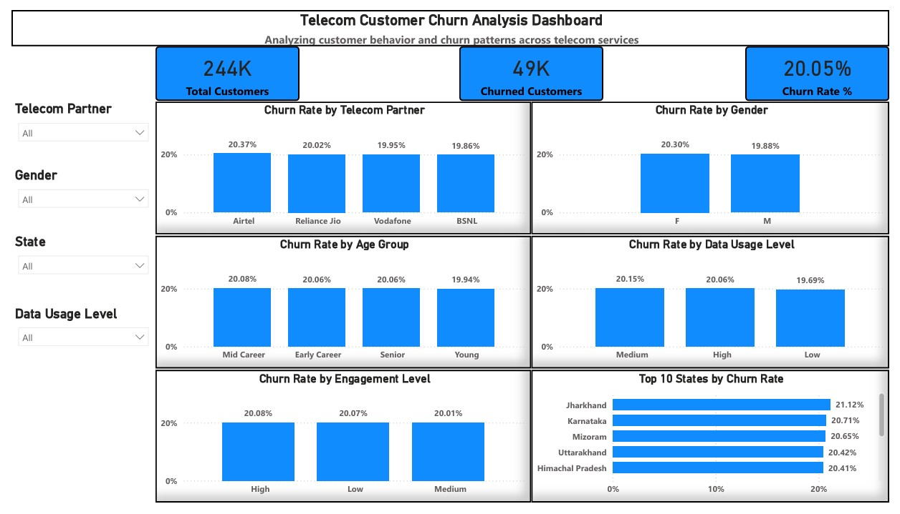

# Telecom Customer Churn Analysis

## Project Overview
This project analyzes telecom customer churn using SQL and Power BI. 
The objective is to identify patterns in customer behavior and understand factors associated with churn.

## Tools Used
- SQL (MySQL)
- Power BI
- Excel

## Data Processing
The dataset was cleaned using SQL by handling missing values and invalid data.

Feature engineering was performed to create:
- Data Usage Level
- Engagement Score
- Engagement Level
- Tenure Groups

## Analysis Performed
- Overall churn rate
- Churn by telecom partner
- Churn by gender
- Churn by age group
- Churn by data usage level
- Churn by engagement level
- Top states by churn rate

## Dashboard
An interactive dashboard was created in Power BI to visualize churn patterns.

## Dashboard Preview

